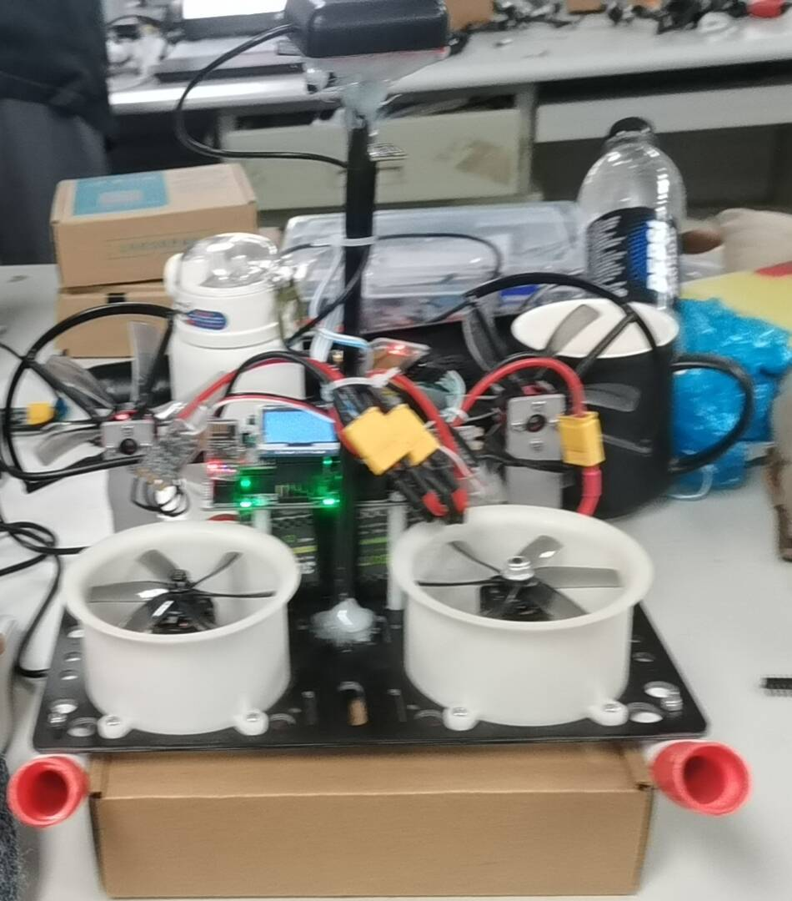
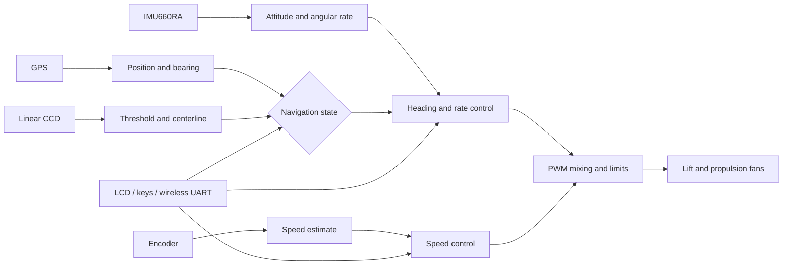

# STC32G12K128 Hovercraft Control System

> Embedded control firmware for a hovercraft developed for the 20th Smart Car Competition

[中文说明](README.md) | [Third-party notices](THIRD_PARTY_NOTICES.md)

## Overview

This project implements the control stack of an autonomous hovercraft around the STC32G12K128 MCU. It connects environmental sensing, state estimation, navigation decisions, feedback control, and fan actuation in one embedded firmware project. GPS, IMU, linear CCD, and encoder measurements provide feedback for the speed, heading, and line-following controllers.

The firmware is derived from the Chengdu Seekfree STC32G12K128 open-source library. It retains the upstream low-level drivers and copyright notices while adding hovercraft-specific navigation, control, parameter management, and debugging modules. This repository is a competition project archive, not an official Seekfree project.

  

<em>Hardware prototype with two front ducted fans, the controller, and the sensor platform</em>

## Architecture

The control path can switch between GPS waypoint navigation and CCD line following. GPS mode derives distance and bearing to a target point, while CCD mode adjusts the two propulsion outputs from the detected centerline error. The IMU and encoder provide angular-rate and speed feedback.

## Main Components

| Component | Implementation | Source |
| --- | --- | --- |
| Motion control | Heading outer loop, angular-rate inner loop, incremental speed PID, output limits | `Project/CODE/control.c`, `pid.c` |
| Actuation | Four PWM channels, lift and differential propulsion outputs, stopped state | `Project/CODE/motor.c` |
| GPS navigation | Waypoint storage, coordinate differences, distance and bearing | `Project/CODE/GPS.c` |
| State estimation | IMU offset calibration, yaw integration, Mahony attitude estimation | `Project/CODE/IMU.c` |
| CCD perception | Adaptive thresholding, binarization, border search, centerline error | `Project/CODE/camera.c` |
| Parameter interface | LCD menu, key input, PID parameters, GPS waypoint display | `Project/CODE/menu.c` |
| Telemetry | Wireless UART transport and VOFA data frames | `Project/CODE/VOFA.c` |

## Runtime Model

The firmware combines a foreground loop with periodic interrupt-driven control tasks:

- The main loop parses GPS messages, updates the menu, and processes CCD thresholds and centerlines.
- A 5 ms timer task handles navigation state, heading feedback, mode selection, and fan control.
- A 10 ms timer task samples encoder speed and updates the speed and heading outer loops.
- UART interrupts receive GPS and wireless serial data independently of the control path.

This organization separates lower-rate interaction and parsing from time-sensitive feedback control.

## Platform

| Category | Configuration |
| --- | --- |
| MCU | STC32G12K128 |
| IDE / compiler | Keil MDK for C251 V5.60 |
| IMU | Seekfree IMU660RA |
| Positioning | TAU1201 GPS (driver included in this source tree) |
| Track sensing | Linear CCD |
| Speed feedback | Incremental encoder |
| Debugging and input | LCD, keys, wireless UART, VOFA |

## Repository Layout

- `Libraries/libraries/`: STC32G12K128 platform support
- `Libraries/seekfree_libraries/`: GPIO, UART, PWM, timer, and other drivers
- `Libraries/seekfree_peripheral/`: IMU, GPS, display, and CCD drivers
- `Project/CODE/`: hovercraft application and control algorithms
- `Project/USER/`: main program and interrupt handlers
- `Project/MDK/SEEKFREE.uvproj`: Keil project

## Build

Open `Seekfree_STC32G12K128_Opensource_Library/Project/MDK/SEEKFREE.uvproj` with Keil MDK for C251 V5.60, select the `STC32G12K128` target, and run Build or Rebuild. The generated image is written to `Project/MDK/Out_File/SEEKFREE.hex`.

Routine build output and per-user Keil state are excluded from version control. A vehicle-tested firmware image can be published separately as a GitHub Release asset.

## Project Scope

- Control parameters are specific to the vehicle mechanics, sensor installation, and track conditions.
- The included Chinese pinout file comes from an earlier project and is retained only as a hardware reference.
- Most inherited sources use GBK encoding for compatibility with the existing Keil project; repository documentation uses UTF-8.
- The project depends on the proprietary Keil C251 toolchain and currently has no public automated build pipeline.
- Bench testing requires verification of PWM polarity, stop behavior, output limits, and sensor orientation before the fans are loaded.

## Origin and License

The project references the following Chengdu Seekfree upstream projects:

| Upstream project | Role or relationship | Link |
| --- | --- | --- |
| STC32G12K128 Library | MCU SDK, low-level drivers, and Keil project base | [seekfree/STC32G12K128_Library](https://gitee.com/seekfree/STC32G12K128_Library.git) |
| STC32G Brushless Driver Project | Reference for brushless motor driver implementation | [seekfree/STC32G_Brushless_Driver_Project](https://gitee.com/seekfree/STC32G_Brushless_Driver_Project.git) |
| GN42A Product | Reference for GPS product driver and interface | [seekfree/GN42A_Product](https://gitee.com/seekfree/GN42A_Product.git) |

The bundled version history identifies the STC32G12K128 library base as V1.9.1, dated 2024-12-30. The current source tree contains the `SEEKFREE_GPS_TAU1201.c/.h` driver; the GN42A repository is recorded as a GPS upstream reference and does not imply that GN42A hardware has been adapted here. Upstream copyright notices and the root [GPLv3 license](LICENSE) are retained. Some source files and precompiled libraries carry separate notices; see [THIRD_PARTY_NOTICES.md](THIRD_PARTY_NOTICES.md) for details.
