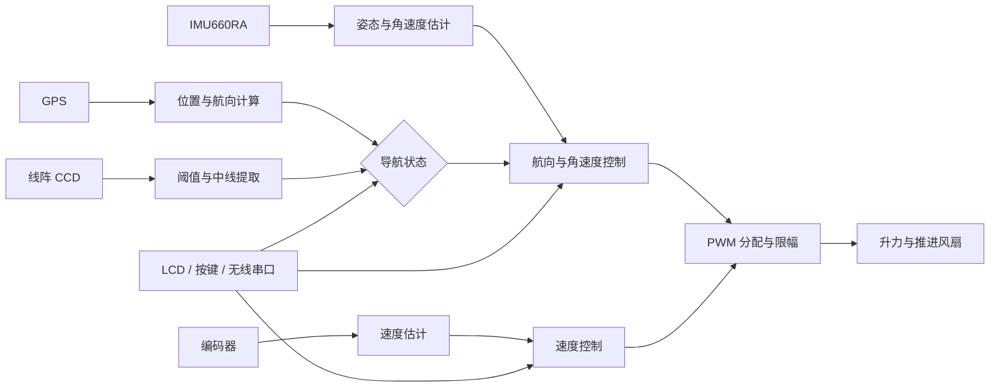

# STC32G12K128 气垫船控制系统

> 面向第二十届智能车竞赛气垫船项目的嵌入式控制固件

[English](README.en.md) | [第三方代码与许可说明](THIRD_PARTY_NOTICES.md)

## 项目概览

本项目以 STC32G12K128 为主控，围绕气垫船的自主运动构建了从环境感知、状态估计、路径判断到风扇驱动的完整控制链路。系统融合 GPS、IMU、线阵 CCD 和编码器数据，并通过多组 PID 控制器完成速度、航向和循迹控制。

项目在成都逐飞科技 STC32G12K128 开源库基础上开发，保留了原有底层驱动和版权声明，在其上实现了气垫船相关的控制、导航、参数管理与调试模块。本仓库为参赛工程归档，不是逐飞科技官方项目。

<p align="center">
  
</p>

<p align="center"><em>气垫船实物原型：前置双涵道风扇、控制器与传感器平台</em></p>

## 系统架构



控制系统支持在 GPS 航点导航与 CCD 循迹之间切换。GPS 模式根据目标点计算距离和方位角，CCD 模式根据赛道中线偏差修正左右推进输出；IMU 和编码器分别提供角速度与速度反馈。

## 核心实现

| 模块 | 实现内容 | 主要代码 |
| --- | --- | --- |
| 运动控制 | 航向角外环、角速度内环、速度增量式 PID、输出限幅 | `Project/CODE/control.c`、`pid.c` |
| 执行器 | 四路 PWM 初始化、升力与左右推进输出、停机状态 | `Project/CODE/motor.c` |
| GPS 导航 | 航点记录与读取、坐标差分、距离和方位角计算 | `Project/CODE/GPS.c` |
| 姿态估计 | IMU 零偏标定、Yaw 积分、Mahony 姿态解算 | `Project/CODE/IMU.c` |
| CCD 感知 | 自适应阈值、二值化、边界搜索和中线误差计算 | `Project/CODE/camera.c` |
| 参数交互 | LCD 菜单、按键状态、PID 参数与 GPS 航点查看 | `Project/CODE/menu.c` |
| 数据调试 | 无线串口收发与 VOFA 数据帧 | `Project/CODE/VOFA.c` |

## 运行时组织

系统采用主循环与定时中断协同的结构：

- 主循环持续完成 GPS 数据解析、菜单交互以及 CCD 阈值和中线更新。
- 5 ms 定时任务处理 GPS 状态、航向反馈、导航模式切换和风扇控制。
- 10 ms 定时任务读取编码器速度，计算速度环和航向角外环输出。
- UART 中断分别接收 GPS 与无线串口数据，传感器驱动和控制逻辑通过统一头文件组织。

这种划分将低频交互与高频闭环控制分离，保证主要控制周期不依赖界面刷新或串口处理速度。

## 硬件与工具链

| 类别 | 配置 |
| --- | --- |
| MCU | STC32G12K128 |
| IDE / 编译器 | Keil MDK for C251 V5.60 |
| 姿态传感器 | 逐飞 IMU660RA |
| 定位模块 | TAU1201 GPS |
| 赛道感知 | 线阵 CCD |
| 速度反馈 | 增量式编码器 |
| 调试与交互 | LCD、按键、无线串口、VOFA |

## 代码结构

```text
Seekfree_STC32G12K128_Opensource_Library/
|-- Libraries/
|   |-- libraries/              # STC32G12K128 基础支持
|   |-- seekfree_libraries/     # GPIO、UART、PWM、定时器等驱动
|   `-- seekfree_peripheral/    # IMU、GPS、屏幕、CCD 等外设驱动
`-- Project/
    |-- CODE/                   # 气垫船业务与控制算法
    |-- USER/                   # 主程序和中断入口
    `-- MDK/SEEKFREE.uvproj     # Keil 工程
```

程序入口为 `Project/USER/src/main.c`，中断调度位于 `Project/USER/src/isr.c`，气垫船相关实现集中在 `Project/CODE/`。

## 构建方式

1. 安装 Keil MDK for C251 V5.60 和 STC32G12K128 设备支持。
2. 打开 `Seekfree_STC32G12K128_Opensource_Library/Project/MDK/SEEKFREE.uvproj`。
3. 选择 `STC32G12K128` Target 并执行 Build 或 Rebuild。
4. 编译生成的固件位于 `Project/MDK/Out_File/SEEKFREE.hex`，可通过 STC-ISP 或车辆配套下载器烧录。

日常编译产物和 Keil 用户配置不纳入版本控制；经过实车验证的固件适合作为 GitHub Release 附件发布。

## 工程边界

- 这是面向特定车辆和赛道条件开发的竞赛固件，PID、CCD、GPS 和 PWM 参数具有明显的硬件相关性。
- 仓库内的 `十九届引脚推荐.txt` 来源于早期工程，仅保留为硬件设计参考，不代表第二十届车辆的最终接线。
- 逐飞基础库及部分项目源码使用 GBK 编码，仓库文档使用 UTF-8。
- 工程依赖 Keil C251 工具链，目前未配置可公开运行的自动化编译流程。
- 风扇系统具有较高转速，台架调试需确认 PWM 极性、停机逻辑、输出限幅和传感器方向。

## 来源与许可

工程所附版本记录显示，基础库版本为成都逐飞科技 STC32G12K128 开源库 V1.9.1（2024-12-30）。仓库保留上游源码中的版权声明和根目录 [GPLv3 许可证](LICENSE)。部分源码与预编译库包含单独的版权或使用说明，具体边界见 [THIRD_PARTY_NOTICES.md](THIRD_PARTY_NOTICES.md)。
